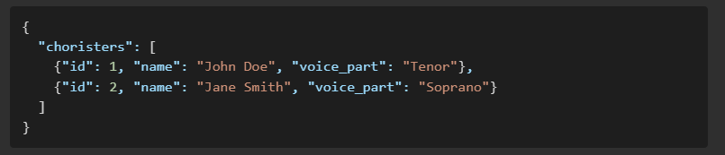
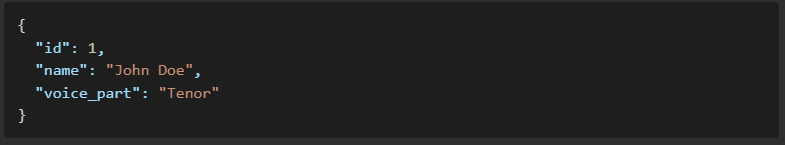
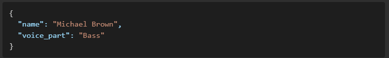
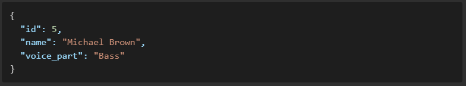
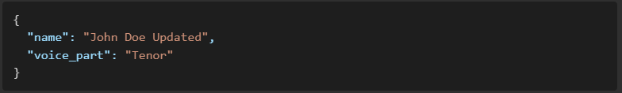
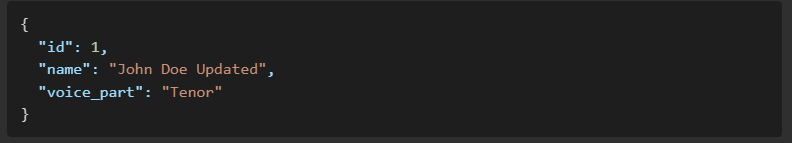

Chorister Management API

Overview

This is a simple RESTful API built with Flask to manage a list of choristers. It allows users to perform CRUD (Create, Read, Update, Delete) operations on chorister data.

Features:

    - Retrieve all choristers

    - Get a specific chorister by ID

    - Add a new chorister

    - Update an existing chorister

    - Delete a chorister

Technologies Used:

    - Python

    - Flask

Installation

    - Prerequisites

    - Python (>=3.6)

    - pip (Python package manager)

Setup: - Clone the repository: git clone https://github.com/your-repo/flask-chorister-api.git
cd flask-chorister-api

    - Install dependencies: pip install flask
    - Run the application: python app.py
    - The API will start at http://127.0.0.1:5000/

API Endpoints 1. Get All Choristers

        - Endpoint: GET /api/choristers
        - Description: Returns a list of all choristers.
        - Response: 

    2. Get a Single Chorister by ID

        - Endpoint: GET /api/choristers/<chorister_id>
        - Description: Retrieves a chorister by their ID.
        - Response: 

    3. Add a New Chorister

        - Endpoint: POST /api/choristers
        - Description: Adds a new chorister to the list.
        - Request Body: 
        - Response: 

    4. Update an Existing Chorister
        - Endpoint: PUT /api/choristers/<chorister_id>
        - Description: Updates a chorister's details.
        - Request Body: 
        - Response:

    5. Delete a Chorister

        - Endpoint: DELETE /api/choristers/<chorister_id>
        - Description: Removes a chorister from the list.
        - Response: 204 No Content
